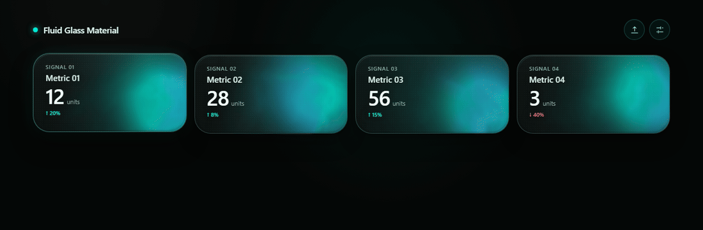
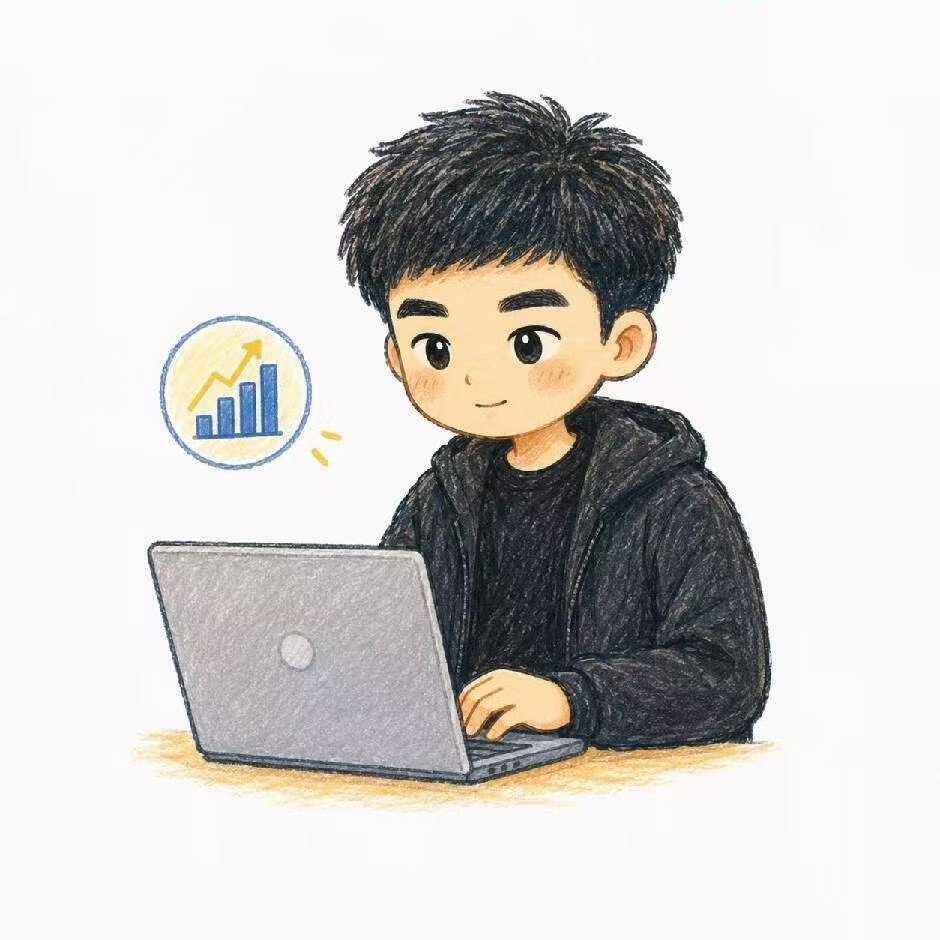

# Fluid Glass UI

[](LICENSE)

**English · [中文](README.zh-CN.md)**

Production-grade **WebGL fluid glass card interfaces** with a fixed canonical material core and an open, data-driven business configuration — packaged as an installable **agent skill** and a **zero-dependency front-end reference implementation**.

Open the [single-file demo](references/canonical-demo-single-file.html) directly in any modern browser to see the result: transparent fluid glass cards, pointer disturbance, and graceful CSS fallback.



## What this is

Most text-prompt "glassmorphism" attempts drift visually between runs. This package solves that by inverting the design: the **visual material is fixed and canonical**, while everything business-specific stays configurable.

- **Fixed (canonical material core):** card geometry (144px tall, 30px radius), glass layer order, transparency budget, the WebGL shader (FBM + domain warp + reveal + plumes), pointer disturbance, and the CSS fallback path.
- **Open (business configuration):** card count, labels, values, units, colors, palettes, motion, quality, and the `localStorage` key.

Any downstream project — or any Agent that loads this skill — gets the same visual DNA, guaranteed by hashed core assets and an automated QA gate.

## Features

- **WebGL1 fluid shader** — FBM + domain warp, `alpha:true` transparent canvas, `gl.clearColor(0,0,0,0)`
- **Pointer disturbance** — push and curl the fluid with mouse/touch
- **Quality profiles** — `auto / high / balanced / eco / fallback`
- **CSS fallback** — automatic when WebGL is unavailable or the context budget is reached
- **WebGL context budget** — max 8 live contexts (iOS-Safari-safe); extra cards render via CSS fallback
- **Zero dependencies** — no CDN, no external fonts, no network requests; works from `file://`
- **Data-driven cards** — up to 12 cards, arbitrary `key`s, optional chart extension (default off)
- **Runtime control** — `window.FluidGlassMaterial.*` API for palette, quality, motion, export
- **`localStorage` persistence** and **single-click HTML export**
- **Performance hygiene** — shared RAF manager, visibility pause, `ResizeObserver`, `IntersectionObserver`, `prefers-reduced-motion`

## Quick start

### 1. Just look at it

```bash
# open the single-file demo directly (no server, no build)
open references/canonical-demo-single-file.html     # macOS / Linux
start references/canonical-demo-single-file.html    # Windows
# or the modular version
open references/canonical-demo.html
```

### 2. Use it as an Agent skill

1. Copy the whole directory into your Agent's skill folder (entry is `SKILL.md`, see `manifest.json`).
2. Ask the Agent to "build a fluid glass metric dashboard".
3. The Agent must follow `SKILL.md`: read the canonical assets in `references/`, reuse them, and self-check against `ACCEPTANCE_CHECKLIST.md`.

If your Agent cannot auto-load skills, paste `MASTER_PROMPT.md` (full) or `QUICK_START_PROMPT.md` (condensed) as the prompt.

### 3. Integrate into an existing front-end

Copy the three core assets and construct cards:

```bash
references/fluid-glass-material.css     # material + geometry
references/canonical-fragment-shader.glsl
references/canonical-vertex-shader.glsl
references/fluid-glass-engine.js        # FluidGlassRenderer / FluidGlassManager / materialTokens() / qualityProfile()
```

Full integration guidance, caveats (dark background required, 144px height fixed, alpha budget), and the change workflow live in [INTEGRATION_GUIDE.md](INTEGRATION_GUIDE.md).

## Configuration

Cards are a plain array. `key` is caller-supplied (or auto-generated) — never a fixed business ID.

```json
{
  "storageKey": "fluid_glass_material_config",
  "quality": "auto",
  "interaction": true,
  "cards": [
    {
      "key": "revenue-summary",
      "label": "Revenue",
      "eyebrow": "MONTHLY",
      "value": "12.8M",
      "unit": "USD",
      "change": 8.4,
      "preset": "cyan",
      "a": "#00e7d2",
      "b": "#3cc8ff",
      "c": "#075f68",
      "speed": 0.92,
      "intensity": 1.02,
      "pointer": 0.82,
      "surface": 0.08,
      "seed": 1.7,
      "chart": { "enabled": false }
    }
  ]
}
```

- JSON Schema: [CONFIG_SCHEMA.json](CONFIG_SCHEMA.json)
- Neutral example: [REFERENCE_CONFIG.json](REFERENCE_CONFIG.json)
- Field semantics + runtime API: [COMPONENT_API.md](COMPONENT_API.md)
- Palettes: `cyan`, `original`, `klein`, `chrome`

### Runtime API

Exposed after the engine loads:

```js
FluidGlassMaterial.getConfig() / getStatus()
FluidGlassMaterial.openSettings() / closeSettings()
FluidGlassMaterial.save() / exportHtml() / pause() / resume()
FluidGlassMaterial.setQuality(v)
FluidGlassMaterial.setPalette(key, preset)
FluidGlassMaterial.setColors(key, a, b, c)
FluidGlassMaterial.setSurface(key, v)
FluidGlassMaterial.setMotion(key, { speed?, intensity?, pointer? })
```

## Project structure

```
fluidglass-ui/
├── SKILL.md                  # Agent skill entry (YAML frontmatter required)
├── MASTER_PROMPT.md          # full task prompt
├── QUICK_START_PROMPT.md     # condensed prompt
├── DESIGN_SYSTEM.md          # immutable visual core vs configurable boundary
├── COMPONENT_API.md          # config model + runtime API
├── CONFIG_SCHEMA.json        # JSON Schema
├── REFERENCE_CONFIG.json     # brand-neutral example config
├── ACCEPTANCE_CHECKLIST.md   # consistency acceptance criteria
├── INTEGRATION_GUIDE.md      # integration & contribution workflow
├── CANONICAL_CORE_HASHES.json# sha256 manifest of the canonical core
├── README.md                 # English README
├── README.zh-CN.md           # 中文 README
├── CHANGELOG.md
├── manifest.json
├── docs/
│   ├── demo.gif              # animated demo (README hero)
│   └── brand/                # author brand assets (reserved rights, not Apache-2.0)
│       ├── xiaoce-avatar.jpg
│       └── README.md         # brand license notice
├── references/               # canonical material core + reference implementation
│   ├── canonical-fragment-shader.glsl
│   ├── canonical-vertex-shader.glsl
│   ├── fluid-glass-material.css
│   ├── fluid-glass-engine.js
│   ├── canonical-demo.html            # modular demo
│   ├── canonical-demo-single-file.html# single-file demo (open directly)
│   ├── canonical-reference.png        # visual baseline
│   └── visual-regression-spec.md      # screenshot regression spec
└── tools/
    └── package_qa.py         # integrity + canonical-core QA (no deps)
```

## Quality gates

```bash
python tools/package_qa.py          # must print "passed": true
python tools/package_qa.py --update-hashes   # regenerate core hashes after core changes
node --check references/fluid-glass-engine.js
```

CI ([.github/workflows/qa.yml](.github/workflows/qa.yml)) runs the same gates on every push/PR. Changing any canonical core file **requires** regenerating `CANONICAL_CORE_HASHES.json` and a side-by-side screenshot against `canonical-reference.png` — see [CONTRIBUTING.md](CONTRIBUTING.md).

## Browser support

- WebGL1-capable desktop & mobile browsers (Chrome, Edge, Firefox, Safari) — fluid shader.
- Browsers without WebGL — automatic CSS fallback.
- **Context budget:** the engine caps at 8 live WebGL contexts (iOS-Safari safety limit). On 9–12 card layouts, cards beyond the 8th render via CSS fallback.
- Cards are capped at 12 per config.

## Contributing

See [CONTRIBUTING.md](CONTRIBUTING.md). Bug fixes, doc improvements, browser-compat work, and new *additional* color presets are welcome. Core-visual changes go through a stricter review: Issue discussion first, screenshot diff, hash sync, QA green.

## License

[Apache-2.0](LICENSE) © 2026 csuyincs-creator (清晨方白晓). By contributing you agree your contributions are released under the same license. Brand assets under [`docs/brand/`](docs/brand/) are reserved rights and not part of the Apache grant.

## Author



**清晨方白晓** · [csuyincs-creator](https://github.com/csuyincs-creator) · Central South University engineering graduate student · Exploring AI implementation practices and Vibe Coding, sharing what I build.

- 公众号 / WeChat: **清晨方白晓**
- 小红书 / 抖音 (Xiaohongshu & Douyin): **清晨方白晓**

The 小策 character artwork is the author's personal IP — see the [brand notice](docs/brand/README.md).
